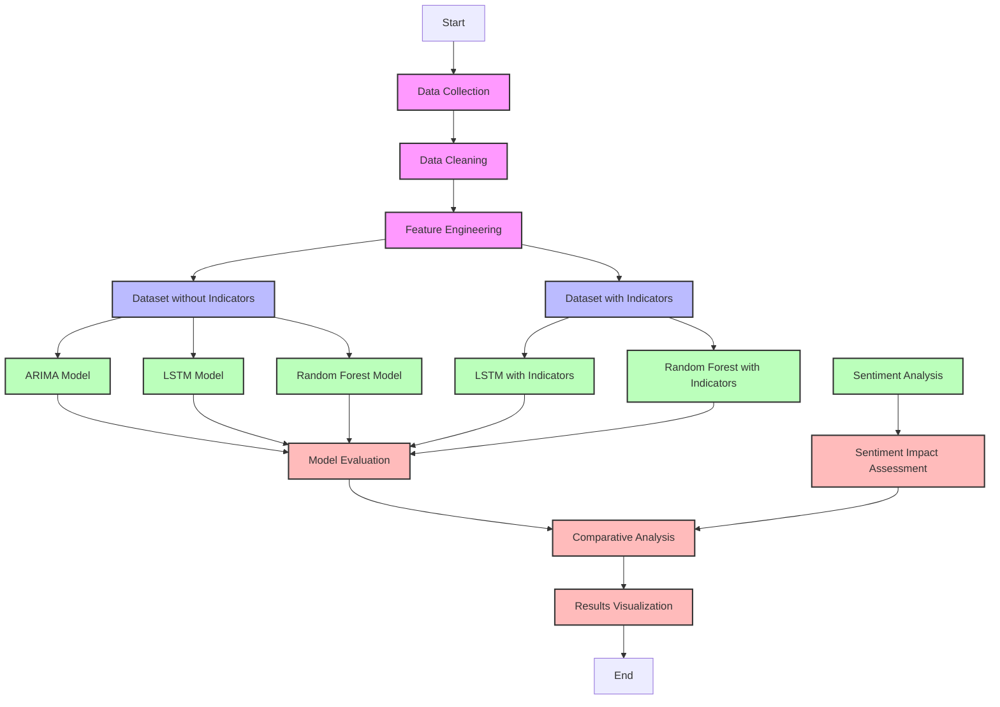

## 🔍 Usage Guide

### 1. Collect Stock Data

Run the data collection notebook to fetch historical stock data:

```bash
jupyter notebook data_collection_and_cleaning.ipynb
```

Sample code:
```python
# Function to fetch stock data
def fetch_stock_data(ticker, start="2010-01-01", end="2025-01-01"):
    data = yf.download(ticker, start=start, end=end, multi_level_index=False)
    data = data[['Open', 'High', 'Low', 'Close', 'Volume']]
    data.reset_index(inplace=True)  # Ensure Date is a column
    return data

# Example usage - Replace "AAPL" with any stock symbol
stock_symbol = "AAPL"  # You can change this to any stock
data = fetch_stock_data(stock_symbol)

# Save to CSV (Optional)
data.to_parquet(f"./stock_data/{stock_symbol}_stock_data.parquet", index=False)
```

### 2. Generate Technical Indicators

Calculate technical indicators using the feature engineering notebook:

```bash
jupyter notebook feature_engineering.ipynb
```

Sample code:
```python
# Compute Relative Strength Index (RSI)
data['RSI'] = talib.RSI(data['Close'], timeperiod=14)

# Compute Exponential Moving Averages (EMA)
data['EMA_10'] = talib.EMA(data['Close'], timeperiod=10)
data['EMA_50'] = talib.EMA(data['Close'], timeperiod=50)

# Compute Simple Moving Averages (SMA)
data['SMA_10'] = talib.SMA(data['Close'], timeperiod=10)
data['SMA_50'] = talib.SMA(data['Close'], timeperiod=50)

# Compute Moving Average Convergence Divergence (MACD)
data['MACD'], data['MACD_Signal'], _ = talib.MACD(data['Close'], fastperiod=12, slowperiod=26, signalperiod=9)
```

### 3. Train and Compare Models

Execute the models notebook to train and evaluate all prediction models:

```bash
jupyter notebook models.ipynb
```

This notebook will:
- Train ARIMA models on the base dataset
- Train LSTM models on both datasets (with and without indicators)
- Train Random Forest models on both datasets (with and without indicators)
- Compute evaluation metrics for all models
- Save predictions for later comparison

### 4. Run Sentiment Analysis

Process news data and generate sentiment scores:

```bash
jupyter notebook sentiment_analyzer.ipynb
```

Sample code:
```python
import pandas as pd

# Load sentiment data from both sources
google_news_df = pd.read_parquet("./news_data/Google_News_with_Sentiment.parquet")
yahoo_news_df = pd.read_parquet("./news_data/Yahoo_Finance_News_with_Sentiment.parquet")

# Compute daily average sentiment score for each source
google_sentiment = google_news_df['sentiment_score'].mean()
yahoo_sentiment = yahoo_news_df['sentiment_score'].mean()

# Compute overall sentiment score
overall_sentiment = (google_sentiment + yahoo_sentiment) / 2

# Define Buy/Sell/Hold Recommendation
def get_recommendation(sentiment_score):
    if sentiment_score > 0.3:
        return "Buy"
    elif sentiment_score < -0.3:
        return "Sell"
    else:
        return "Hold"

# Get recommendation based on overall sentiment
recommendation = get_recommendation(overall_sentiment)

# Display the result
print(f"Google Sentiment Score: {google_sentiment:.2f}")
print(f"Yahoo Sentiment Score: {yahoo_sentiment:.2f}")
print(f"Overall Sentiment Score: {overall_sentiment:.2f}")
print(f"Trading Recommendation: {recommendation}")
```
# Stock Price Predictor: Model Comparison Study 📈

[](https://opensource.org/licenses/MIT)

## Overview

A comprehensive comparative study of machine learning models for stock price prediction. This project evaluates multiple forecasting approaches including ARIMA, LSTM, and Random Forest (with and without technical indicators) to determine their relative effectiveness. The study also incorporates sentiment analysis from financial news to explore its impact on predictive performance.


## ✨ Features

- **Model Comparison**: Rigorous evaluation of ARIMA, LSTM, and Random Forest models
- **Technical Indicator Analysis**: Testing models both with and without technical indicators
- **Sentiment Analysis**: Measuring impact of news sentiment on prediction accuracy
- **Interactive Visualizations**: Side-by-side model performance comparisons
- **Statistical Validation**: Comprehensive error metrics and significance testing

## 📊 Project Workflow

The following diagram illustrates the comparative model evaluation workflow:



## 🛠️ Project Structure

```
StockPriceAnalyzer/
│── models/                          # Model predictions and comparisons
│   ├── ARIMA_Predictions.parquet
│   ├── LSTM_No_Indicators_Predictions.parquet
│   ├── LSTM_with_Indicators_Predictions.parquet
│   ├── RandomForest_No_Indicators.parquet
│   ├── RandomForest_With_Indicators.parquet
│
│── news_data/                       # Financial news data with sentiment scores
│   ├── Google_News.parquet
│   ├── Yahoo_Finance_News.parquet
│   ├── Google_News_with_Sentiment.parquet
│   ├── Yahoo_Finance_News_with_Sentiment.parquet
│
│── stock_data/                      # Raw and processed stock data
│   ├── AAPL_stock_data.parquet
│   ├── Processed_Stock_Data.parquet
│   ├── Processed_Stock_Data_with_Indicators.parquet
│
│── data_collection_and_cleaning.ipynb    # Data acquisition and preprocessing
│── feature_engineering.ipynb        # Technical indicator computation
│── models.ipynb                     # Model training and comparative evaluation
│── sentiment_analyzer.ipynb         # News sentiment analysis
│── trial_arima_model.ipynb          # ARIMA model experiments
│── visualization.ipynb              # Comparative visualization of results
```

## 📋 Requirements

- Python 3.7+
- pandas
- numpy
- scikit-learn
- tensorflow
- yfinance
- TA-Lib
- NLTK
- Plotly

## 🚀 Installation

### 1. Clone the Repository

```bash
git clone https://github.com/Naushil7/StockPriceAnalyzer.git
cd StockPriceAnalyzer
```

### 2. Set Up a Virtual Environment (Recommended)

```bash
python -m venv venv
source venv/bin/activate  # On Windows use: venv\Scripts\activate
```

### 3. Install Required Packages

```bash
pip install -r requirements.txt
```

> **Note:** Make sure to install `TA-Lib` and `yfinance` for technical indicators and stock data retrieval.

## 🔍 Usage Guide

### 1. Collect Stock Data

Run the data collection notebook to fetch historical stock data:

```bash
jupyter notebook data_collection_and_cleaning.ipynb
```

Sample code:
```python
# Function to fetch stock data
def fetch_stock_data(ticker, start="2010-01-01", end="2025-01-01"):
    data = yf.download(ticker, start=start, end=end, multi_level_index=False)
    data = data[['Open', 'High', 'Low', 'Close', 'Volume']]
    data.reset_index(inplace=True)  # Ensure Date is a column
    return data

# Example usage - Replace "AAPL" with any stock symbol
stock_symbol = "AAPL"  # You can change this to any stock
data = fetch_stock_data(stock_symbol)

# Save to CSV (Optional)
data.to_parquet(f"./stock_data/{stock_symbol}_stock_data.parquet", index=False)
```

### 2. Generate Technical Indicators

Calculate technical indicators using the feature engineering notebook:

```bash
jupyter notebook feature_engineering.ipynb
```

Sample code:
```python
# Compute Relative Strength Index (RSI)
data['RSI'] = talib.RSI(data['Close'], timeperiod=14)

# Compute Exponential Moving Averages (EMA)
data['EMA_10'] = talib.EMA(data['Close'], timeperiod=10)
data['EMA_50'] = talib.EMA(data['Close'], timeperiod=50)

# Compute Simple Moving Averages (SMA)
data['SMA_10'] = talib.SMA(data['Close'], timeperiod=10)
data['SMA_50'] = talib.SMA(data['Close'], timeperiod=50)

# Compute Moving Average Convergence Divergence (MACD)
data['MACD'], data['MACD_Signal'], _ = talib.MACD(data['Close'], fastperiod=12, slowperiod=26, signalperiod=9)
```

### 3. Train Models

Train and evaluate the predictive models:

```bash
jupyter notebook models.ipynb
```

### 4. Run Sentiment Analysis

Process news data and generate sentiment scores:

```bash
python sentiment.py
```

Sample code:
```python
import pandas as pd

# Load sentiment data from both sources
google_news_df = pd.read_parquet("./news_data/Google_News_with_Sentiment.parquet")
yahoo_news_df = pd.read_parquet("./news_data/Yahoo_Finance_News_with_Sentiment.parquet")

# Compute daily average sentiment score for each source
google_sentiment = google_news_df['sentiment_score'].mean()
yahoo_sentiment = yahoo_news_df['sentiment_score'].mean()

# Compute overall sentiment score
overall_sentiment = (google_sentiment + yahoo_sentiment) / 2

# Define Buy/Sell/Hold Recommendation
def get_recommendation(sentiment_score):
    if sentiment_score > 0.3:
        return "Buy"
    elif sentiment_score < -0.3:
        return "Sell"
    else:
        return "Hold"

# Get recommendation based on overall sentiment
recommendation = get_recommendation(overall_sentiment)

# Display the result
print(f"Google Sentiment Score: {google_sentiment:.2f}")
print(f"Yahoo Sentiment Score: {yahoo_sentiment:.2f}")
print(f"Overall Sentiment Score: {overall_sentiment:.2f}")
print(f"Trading Recommendation: {recommendation}")
```

### 5. Visualize and Compare Results

Generate interactive model comparison visualizations:

```bash
jupyter notebook visualization.ipynb
```

This notebook creates:
- Side-by-side performance comparisons of all models
- Error distribution analysis
- Time series plots of predictions vs actual values
- Heatmaps showing error patterns across market conditions
- Statistical significance tests between model performances

## 📊 Key Findings

- **Random Forest** performed better without technical indicators
- **LSTM** showed slightly better performance without indicators
- **Sentiment Analysis** provides valuable additional insights
- Combined approach enables more informed trading decisions

## 🔮 Future Enhancements

- [ ] Expand model comparison to include XGBoost, Prophet, and Transformer-based models
- [ ] Investigate ensemble methods combining the best performing models
- [ ] Conduct cross-asset class testing (stocks, forex, commodities, cryptocurrencies)
- [ ] Explore alternative feature sets beyond standard technical indicators
- [ ] Implement rolling window validation to test model stability over time
- [ ] Develop sensitivity analysis to market regime changes (bull/bear markets)
- [ ] Create interactive model comparison dashboard with Streamlit
- [ ] Benchmark against professional analyst forecasts

## 👤 About the Author

- **Naushil Khajanchi** - Data Scientist & ML Engineer
- [GitHub](https://github.com/Naushil7)
- [LinkedIn](https://www.linkedin.com/in/naushilkhajanchi/)

### Key Findings

1. **Random Forest outperformed other models** without technical indicators (lowest MAE & RMSE)
2. **Adding technical indicators decreased performance** for both LSTM and Random Forest models
3. **ARIMA showed the weakest performance** among all tested models
4. **Sentiment analysis provided complementary insights** but did not significantly improve prediction accuracy when integrated with price data

## 📝 License

This project is licensed under the MIT License - see the LICENSE file for details.

## 🙏 Acknowledgements

- Yahoo Finance for providing historical stock data
- Google News and Yahoo Finance for financial news data
- NLTK for sentiment analysis tools
- TA-Lib for technical indicator calculations
- The machine learning community for benchmarking methodologies
- Research papers that inspired this comparative analysis:
  - "Forecasting stock prices using technical indicators: A comparative study"
  - "LSTM vs Traditional Models for Stock Market Prediction"
  - "The Impact of Technical Indicators on ML-based Stock Prediction Models"